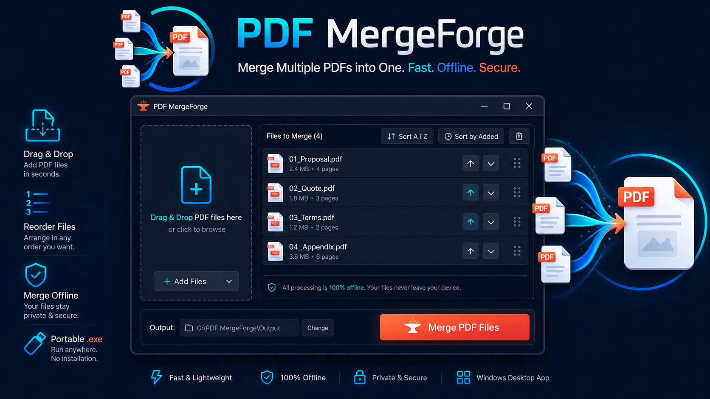
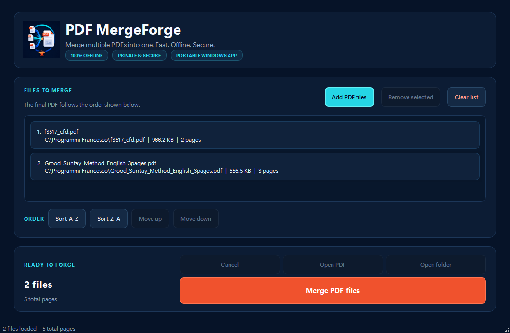
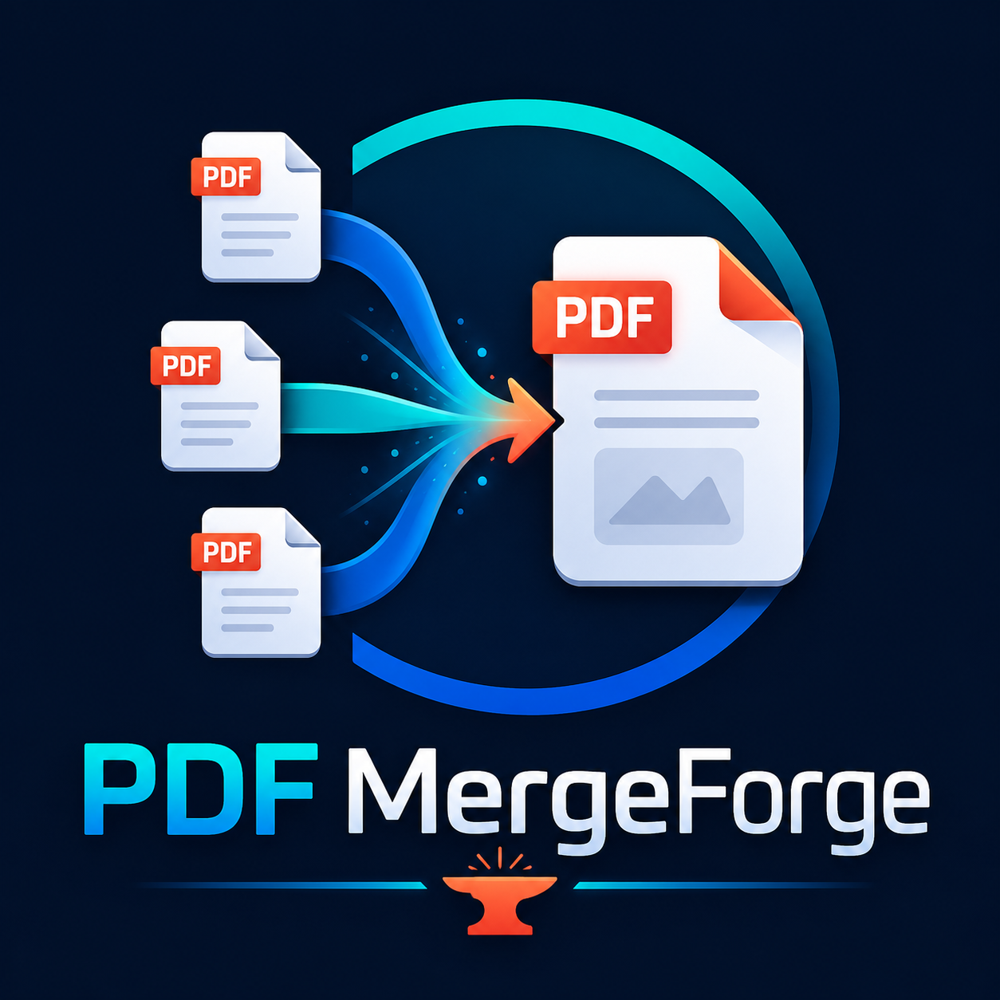

# PDF MergeForge



**Merge PDFs completely on your own computer - no uploads, no subscription, no
provider fees, and no loss of document privacy.**

PDF MergeForge is a fast, portable Windows 10/11 x64 application for ordering,
validating, and safely combining PDF files. It does not need an account, API key,
cloud service, Internet connection, analytics provider, or paid PDF platform.





## Features

- Add multiple PDFs or drag them into the window.
- Brand-matched dark interface with high-contrast controls and clear empty, active,
  progress, success, error, and disabled states.
- Natural A-Z/Z-A sorting, multi-selection, internal drag reordering, Move up/down.
- PDF structure, page-count, encryption, existence, and duplicate validation.
- Responsive background merge, cooperative cancellation, atomic temporary-file output.
- Open the completed PDF or reveal it in Explorer.
- Export an archival PDF/A-1b using a separately installed 64-bit Ghostscript.
- Local-only settings and technical logs in `%LOCALAPPDATA%\PDF MergeForge\logs`.

## Download

1. Open the latest GitHub Release.
2. Download the current `PDF-MergeForge-...-Windows-x64.exe` asset.
3. Double-click the downloaded file.
4. No installation is required.

**That single `.exe` is the only file an end user needs.** It already contains the
Python runtime, the GUI toolkit, the PDF engine, and the application assets. Do not
download the source-code ZIP unless you want to inspect or develop the project.

Windows SmartScreen may warn because the executable is not digitally signed. The one-file build can also take a few seconds to start. Windows 10/11 x64 only.

## PDF/A-1b export

The **Export as PDF/A-1b** button creates an archival PDF/A part 1, conformance level B.
This optional feature invokes a separately installed 64-bit Ghostscript command-line
executable (`gswin64c.exe`). Ghostscript is not included in PDF MergeForge or its EXE;
normal PDF merging continues to work without it.

Install Ghostscript from the [official Ghostscript download page](https://ghostscript.com/releases/gsdnld.html).
The app checks a saved manual location, `PATH`, and versioned folders below
`C:\Program Files\gs`. If automatic detection fails, choose **Locate gswin64c.exe** and
select the executable normally found below `C:\Program Files\gs\<version>\bin`.

Conversion, baseline checks, and optional veraPDF validation all run locally. Baseline
checks verify essential structural indicators but are not a complete standards validation.
If a separately installed veraPDF command-line tool is available, it is used for an
independent PDF/A-1b check. Keep the original documents: conversion can flatten
transparency, alter unsupported features or rendering, and normally invalidates digital
signatures. PDF/A conformance does not guarantee acceptance by every authority.

veraPDF remains optional and external. Install it from the [official veraPDF
releases](https://software.verapdf.org/releases/), open **External tools**, and select
its official `verapdf.bat` launcher. **Validate now** checks the most recently created
PDF without repeating conversion. **Passed** means independent validation succeeded,
**Not performed** means the optional validator was not detected, and **Failed** means
veraPDF reported non-conformance. Baseline checks are safeguards, not a substitute for
independent standards validation.

See [docs/PDF_A_1B.md](docs/PDF_A_1B.md) for setup, limitations, and troubleshooting.

## Development

```powershell
py -3.12 -m venv .venv
.\.venv\Scripts\python -m pip install -r requirements-dev.txt
.\.venv\Scripts\python run_app.py
.\.venv\Scripts\python -m pytest
.\.venv\Scripts\ruff check .
```

Build a diagnostic directory with `build_onedir.bat`, then the portable executable with `build_onefile.bat`. `build_release.ps1` runs quality checks, both builds, and prepares the release files.

The source is under `src/pdf_merger_desktop`, tests under `tests`, and packaging scripts/specifications are in the repository root. Cancellation takes effect between source PDFs and immediately before writing; a very large current PDF page sequence may take time to finish.

## Why local PDF merging matters

Many online PDF services require users to upload contracts, forms, reports, personal
records, or other confidential documents to a third-party server. Some add usage
limits, subscriptions, provider fees, advertising, or account requirements.

PDF MergeForge takes a simpler approach:

- Your documents stay on your Windows computer.
- The merge is performed by the `pypdf` library bundled inside the executable.
- No document is uploaded, transmitted, synchronized, or remotely analysed.
- There are no subscriptions, per-document charges, API fees, or usage limits.
- The application remains usable without an Internet connection.

See [PRIVACY.md](PRIVACY.md) for the exact local data flow and storage behaviour.

## Privacy, security, licensing, and responsibility

Source PDFs are opened read-only and are never uploaded or modified. Password-protected PDFs are rejected; the app does not bypass protection. The program has no automatic updater. Report bugs with the GitHub issue template, excluding sensitive PDFs and logs unless reviewed. MIT licensed.

The source code is licensed under the [MIT License](LICENSE), Copyright (c) 2026
Francesco, creator of PDF MergeForge. The official name, logo, icon, banner, and
artwork are separately protected under [BRAND_LICENSE.md](BRAND_LICENSE.md).

The software is provided **as-is, without warranty**. Use it at your own risk. Users
are responsible for backups, selecting the correct files and destination, verifying
the resulting PDF, and complying with applicable laws and document rights. The
legally controlling warranty and liability disclaimer is in `LICENSE`.

Third-party components and their license notices are documented in
[THIRD_PARTY_NOTICES.md](THIRD_PARTY_NOTICES.md).
